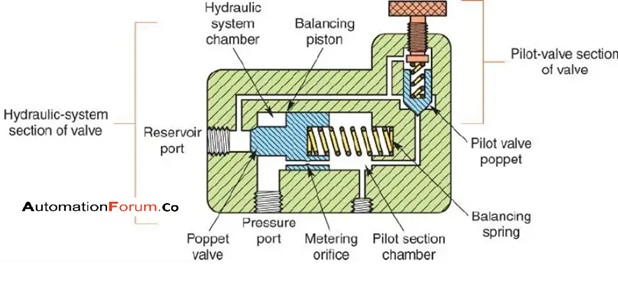
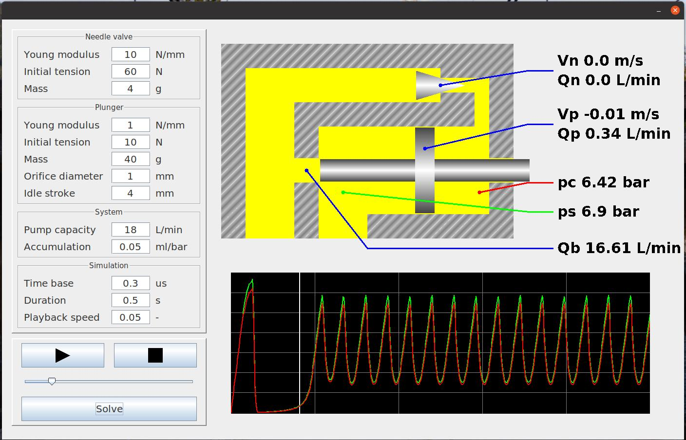
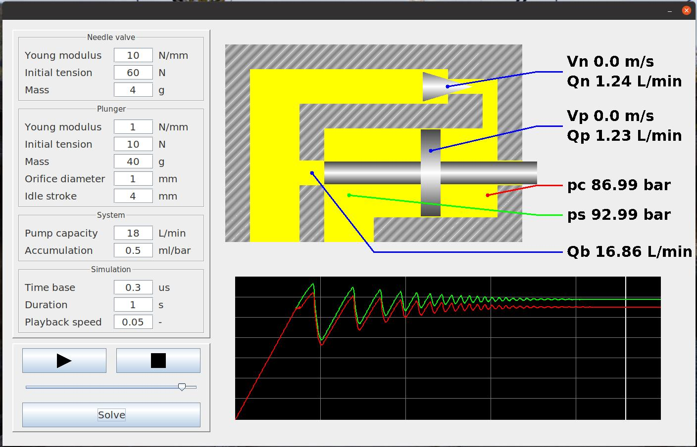

# Relief valve simulation
Program simulates behaviour of compound-type relief valve similar to this one:

## Background
Program has been written after experiencing problems with loud operation/reduced hydraulic pressure on newly installed shipboard compactor.

Suspicion was, that relief valve - under some circumstances - starts resonating causing high pressure peaks observed as loud noise

Simulation results were in-line with various observations (like noise frequency, pressure drop, stable running at low pressure settings) and proven the conception possible (some variables had to be estimated):

By adjusting simulation parameters it was concluded, that installing a small pressure accumulator between pump and hydraulic controller valve can solve the problem:

Unfortunately, I had no opportunity to verify this theory. We had no suitable accumulator onboard, and my contract finished before we were able to get one.